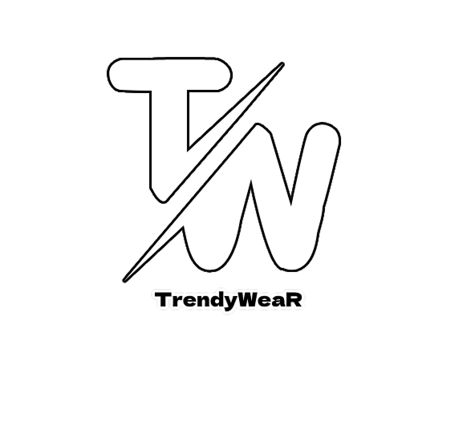

# TrendyWeaR - E-Commerce Store Website

## 📝 Project Summary

**TrendyWeaR** is a modern fashion e-commerce website designed to showcase trendy clothing, provide a seamless shopping experience, and promote conscious fashion. Built using HTML, CSS, Bootstrap 5, and custom SCSS, the site emphasizes both aesthetics and responsiveness. The project includes key sections such as a hero banner, about us, testimonials, contact, and a functional footer with social links.

## 🎨 Design Choices

- **Wireframe & Layout:**
  - Designed in **Figma** for layout planning and responsiveness.
  - Structure follows a classic split layout (text & image) with full-width sections and mobile-first design principles.
    

- **Logo:**
  - The logo was custom-designed using **Photoshop** to align with the brand’s youthful and fashionable tone.

    

- **Colors:**
  - **Primary color**: #d62828 (Deep Red) – used for branding and background elements.
  - **Accent colors**: Yellow and white – used to highlight CTAs and maintain visual balance.
  - Text is contrasted against backgrounds for high readability and accessibility.

## ⚙️ Bootstrap SCSS Customizations

- Customized Bootstrap SCSS variables to:
  - Change the default primary color to match the brand identity.
  - Adjust spacing, padding, and typography settings.
  - Custom form layout (multi-column)
- Used `@import` to extend Bootstrap components and maintain modularity.

## 🚀 Live Demo

🌐 [View Live Website](https://your-live-demo-link.com)

